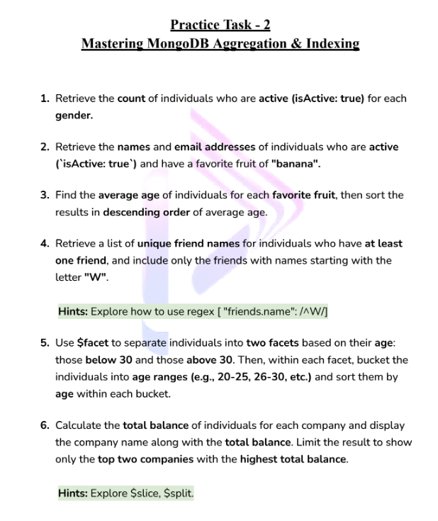

# Mongodb-Aggregation-And-Indexing

## Module-1 : Introduction to powerful aggregation framework

#### What is Aggregation?
- Aggregation is a way of processing a large number of documents in a collection by means of passing them through different stages.
- The stages make up what is known as pipeline
- The stages in a pipeline can filer,sort, group, reshape and modify documents that pass through the pipeline
- Syntax
```javascript
db.collection.aggregate(
    [
        // stage-1
        {} --->pipeline
        // stage-2
        {} --->pipeline
        // stage-3
        {} --->pipeline
    ]
)
``` 
- Data flow : Collection -> Stage1 -> Stage-2 -> Stage-3 -> Final Output

- Rough Example
```javascript
db.cousins.aggregate([
    // filter out the cousins who have exam
    {$match : {hasExam : {$ne :true}}},

    // Filter out cousins who have a budget less than 5000
    {$match :{budget : {$gte :5000}}},

    // filter out cousins who is sick
    {$match : {isSick :true}},

    // sort by age
    {$sort :{age:-1}},

    // limit by 2 
    {$limit :2},

// calculate budget
{
    $group :
    {
        _id:"null",
        totalBudget : {$sum : "$budget"},
        cousins : {$push : "$name"}
    }
}
])
```

## Module-2 : $match , $project aggregation stage

#### $match
- It allow to choose just those documents from a collection that we ant to work with. It does this by filtering out those that do not follow our requirement

#### $project
- In MongoDB, the $project aggregation stage is used to shape the structure of the documents that result from a pipeline. 

#### Difference between regular mongodb to aggregation
```javascript
// Regular
db.test.find({})

// using aggregation
db.test.aggregate([])
```

```javascript
// Regular
db.test.find({
    gender:"Male"
})

// Using aggregation
db.test.aggregate([
    {$match : {gender : "Male"}}
])
```

```javascript
// Regular
db.test.find({
    gender:"Male" , age: {$lte :30}
}).project({name:1,age:1,gender:1})

// Using aggregation
db.test.aggregate([
    // stage-1
    {$match : {gender : "Male"}}

    // stage-2 ---> we have to use $project always at the end 
    {$project : {name:1, age:1, gender:1}}
])
```
## Module-3 : $addFields , $out , $merge aggregation stage
- the more we use stages it will take more time.
- Our Target should be like we will ue less stages
```javascript
db.Test.aggregate([
    // Stage-1: Filter for males
    { $match: { gender: "Male" } },
    
    // Stage-2: Filter for age <= 30
    { $match: { age: { $lte: 30 } } },
    
    // Stage-3: Project only selected fields
    { $project: { gender: 1, age: 1, name: 1 } },
    
    // Stage-4: Sort by age in ascending order (change 1 to -1 for descending order)
    { $sort: { age: 1 } }
])
```
#### $addFields
- If we want to add new filed with the existing field we have to use $addField. It will not modify the original document, it will just add a field in the pipeline.
```javascript
db.Test.aggregate([
    { $match: { gender: "Male" } },
    { $addFields: { course: "Level-2", eduTech: "Programming Hero" } },
    { $project: { course: 1, eduTech: 1, gender: 1 } }
])
```
#### $out
- If we want to add new fields and create a new collection with the added fields we have to use $out
```javascript
db.Test.aggregate([
    { $match: { gender: "Male" } },
    { $addFields: { course: "Level-2", eduTech: "Programming Hero" } },
    // { $project: { course: 1, eduTech: 1, gender: 1 } } // we have to take care of project because it will only add the mentioned fields
    {$out : "Course-Students"}
])
```
#### $merge
- If we want to add new fields and merge with the existing collection we have to use $merge
```javascript
db.Test.aggregate([
    { $addFields: { course: "Level-2", eduTech: "Programming Hero" } },
    {$merge : "Test"}
])
```

## Module-4 : $group , $sum , $push aggregation stage

#### $group and $sum
- with the $group stage we can perform all the aggregation or summarize queries that we need. such as finding counts, total, average or maximum.
- It is responsible for grouping and summarizing documents. It takes multiple documents and arranges them into several separate batches based on grouping.

- This will group the ages based on the duplicate number and show count. Its like if we have three person aged 75, grouping will make one group taking the three person and shw the count 
```javascript
db.Test.aggregate([
    { $group: { _id: "$age", count : {$sum:1} } }
])
```
- Accessing from nested document field
```javascript
db.Test.aggregate([
    { $group: { _id: "$address.country", count : {$sum:1} } } //here {$sum:1} means it will count the documents
])
```

#### $push
- Adds extra values into the array of the resulting document.

- This will additionally add the names who are with the country groups and count the persons
```javascript
db.Test.aggregate([
{$group : {_id : "$address.country", count : {$sum:1}, newAdditionalValue : {$push :"$name"}}}
])
```

- If we want to keep all the documents and after the project afterwards to send some fields in frontend

```javascript
db.Test.aggregate([
    { $group: { _id: "$address.country", count: { $sum: 1 }, newValue: { $push: "$$ROOT" } } },
    { $project: { "newValue.name": 1, "newValue.email": 1, "newValue.age": 1, } }
])
``` 

## Module-5 : Explore more about $group & $project

#### some operators we can use with group

| Operator | Meaning                                                             |
| -------- | ------------------------------------------------------------------- |
| `$count` | Calculates the quantity of documents in the given group.            |
| `$max`   | Displays the maximum value of a document’s field in the collection. |
| `$min`   | Displays the minimum value of a document’s field in the collection. |
| `$avg`   | Displays the average value of a document’s field in the collection. |
| `$sum`   | Sums up the specified values of all documents in the collection.    |
| `$push`  | Adds extra values into the array of the resulting document.         |

```javascript
db.Test.aggregate([
    // Stage-1
    {
        $group: {
            _id: null, 
            // this null means it will consider all the documents under one id. it's like all countries under one world
            totalSalary: { $sum: "$salary" },
            maxSalary: { $max: "$salary" },
            minSalary: { $min: "$salary" },
            avgSalary: { $avg: "$salary" }
        }
    },
    // Stage-2
    {
        $project: {
            totalSalary: 1,
            maxSalary: 1,
            minSalary: 1,
            // we can also do renaming inside $project
            averageSalary: "$avgSalary",
            // we can also do subtraction and others inside $project
            rangeBetweenMaxAndMinSalary: { $subtract: ["$maxSalary", "$minSalary"] }
        }
    }
])
```

## Module-6 : Explore $group with $unwind aggregation stage

#### why to use $unwind?
- You can not work directly on the elements of the array within a documents with stages like $group.
- $unwind stage enables us to work with the values of the fields with the array
- $unwind takes the array and and goes through each and every element of the array and makes individual groups.

```javascript
db.Test.aggregate([
    {$unwind : "$friends"},
    // this will make individual document with each friends
    { $group: { _id: "$friends", count: { $sum: 1 } } }
    // this will group taking the friends and will count which friend is common into which documents
])
```
- if we want to group persons using age and has common interests.
```javascript
db.Test.aggregate([
    { $unwind: "$interests" },
    { $group: { _id: "$age", count: { $sum: 1 }, interestsPerAge: { $push: "$interests" } } }
])
```

## Module-7 : $bucket, $sort, $limit stage

- In MongoDB, the $bucket aggregation stage is used to group documents into a specified number of ranges, or "buckets," based on the values of a specified field. It is particularly helpful for performing range-based data aggregation, similar to SQL's GROUP BY functionality but with custom numeric or date ranges.

```javascript
db.Test.aggregate([
    // Stage 1
    {
        $bucket: {
            groupBy : "$age", // The field used to group documents, in this case, the `age` field.
            boundaries : [20, 40, 60, 80], // Specifies the ranges (or buckets) for grouping.
                                           // This creates buckets: [20-40), [40-60), [60-80).
                                           // Each range is inclusive of the lower bound and exclusive of the upper bound.
            default : "80 er uporer buira gula", // Specifies a label for any values above the last boundary (80).
                                                 // Any documents with age >= 80 will be put into this "default" bucket.
            output: {
                count : { $sum: 1 }, // Counts the number of documents in each bucket.
                karKarAse : { $push : "$$ROOT" } // Pushes the full document (`$$ROOT`) of each document in the bucket
                                                  // into an array called `karKarAse`.
            }
        }
    },

    // Stage 2
    { $sort : { count : -1 } }, // Sorts the output buckets in descending order by the `count` field.
    
    // Stage 3
    { $limit : 4 }, // Limits the output to only the top 4 buckets (based on the sorted count from the previous stage).

    // Stage 4
    { $project: { count : 1 } } // Projects only the `count` field in the final output.
                                // This will return only the count of each bucket, omitting the other fields.
])

```

## Module-8 : $facet, multiple pipeline aggregation stage
- The $facet stage in MongoDB's aggregation pipeline is used to perform multiple, parallel aggregations on the same set of documents, producing separate sub-pipelines that run independently. This is useful when you want to calculate multiple aggregations at once and get a combined result, allowing you to avoid running separate queries for each calculation.

```javascript
db.Test.aggregate([
    {
        $facet: {
            // Pipeline-1
            "friendsCount": [
                // Stage-1
                { $unwind: "$friends" },
                // stage-2
                { $group: { _id: "$friends", count: { $sum: 1 } } }
            ],
            // Pipeline-2
            "educationCount": [
                // Stage-1
                { $unwind: "$education" },
                // stage-2
                { $group: { _id: "$education", count: { $sum: 1 } } }
            ],
            // Pipeline-3
            "skillsCount": [
                // Stage-1
                { $unwind: "$skills" },
                // stage-2
                { $group: { _id: "$skills", count: { $sum: 1 } } }
            ],
        }
    }
])
```

## $lookup stage, embedding vs referencing

This table compares **embedding** and **referencing** based on their use cases and characteristics.

| **Aspect**            | **Embedded**                | **Referencing**                            |
| --------------------- | --------------------------- | ------------------------------------------ |
| **Relationship Type** | One-to-one relationship     | One-to-many or many-to-many relationships  |
| **Best for**          | Frequently reading data     | Frequently writing or updating data        |
| **Updates**           | Atomic updates              | May require multiple updates               |
| **Network Overhead**  | Reduces network overhead    | Higher network overhead for large datasets |
| **Data Size**         | Suitable for small datasets | Scalable for large datasets                |
| **Flexibility**       | Less flexible               | Highly flexible                            |

---

### Use Case Examples

#### Embedded Example:
- Embedding is ideal when you need to store a small, self-contained dataset, such as a user's profile information directly inside a parent document.

#### Referencing Example:
- Referencing works best for relational data, like associating a product with multiple categories or linking users to their orders.


#### Wht is $Lookup?
- In MongoDB, $lookup is an aggregation pipeline stage used to perform joins between collections. It allows you to combine data from two collections, similar to SQL joins, by matching a field from one collection with a field from another. Its like it will look for the referenced data in anther collection and provide us the data by merging with ur data.  

```javascript
db.orders.aggregate([
    {$lookup: {
           from: "<collection to join>",
           localField: "<field from the input documents>",
           foreignField: "<field from the documents of the from collection>",
           as: "<output array field>"
         }}
    ])
```

- example: 
```javascript
db.orders.aggregate([
    {$lookup: {
           from: "Test",
           localField: "userId",
           foreignField: "_id",
           as: "User"
         }}
    ])
```

## What is indexing, COLLSCAN vs IXSCAN
- Lets guess you have my name in a book. If you want to find in by going through line by line it is called COLLSCAN. 
- If you create an index to find it more faster its called IXSCAN. Indexing means you have a content indexes and you can go directly to the desired page. 
- To observe which type is used we can directly make query n mongodb compass or in noSqlBooster.
  
```javascript
// in noSqlBooster
db.Test.find({ email: "mdangl1@odnoklassniki.ru" }).explain("executionStats");
// in mongodb Compass
{ email: "mdangl1@odnoklassniki.ru" }

```
- for massive data we should create indexing. Though we should not create much since more we make indexing more it takes memory 
```javascript
db.getCollection("massive-data").createIndex({email:1})
```

## Explore compound index and text index

- If we want to delete an index we have to use 
```javascript
db.getCollection("massive-data").dropIndex({email:1})
```

#### Search index
- This facilitates us to flexible the searching based n the text of any field. Its like it will not require to write full word to find anything.

- Creating a search index
```javascript
db.getCollection("bigData").createIndex({about :"text"})
``` 
- Example for searching a text 

```javascript
db.getCollection("bigData").find({$text : {$search:"dolor"}}).project({about:1})
``` 

## Problem solution



#### Problem-1
```javascript
db.bigData.aggregate([
    { $match: { isActive: true }},
    
    {$group :{
        _id:"$gender",
        count :{$sum:1}
    }}
])
```

#### Problem-2
```javascript
db.bigData.aggregate([
    { $match: { isActive: true, favoriteFruit :"banana" }},
    {$project : {favoriteFruit:1, isActive:1}}
])
```

#### Problem-3
```javascript
db.bigData.aggregate([
    { 
        $group: { 
            _id: "$favoriteFruit", 
            averageAge: { $avg: "$age" }
        }
    },
    {$sort : {averageAge : -1}}
]);
```

#### Problem-4
```javascript
db.bigData.aggregate([
  { $unwind: "$friends" },
  {
    $match: {
      "friends.name": /^W/,
    },
  },
  {
    $group: {
      _id: "$_id",
      uniqueFriends: { $addToSet: "$friends.name" },
    },
  },
]);
```

#### Problem-5
```javascript
db.bigData.aggregate([
  {
    $facet: {
      below30: [
        { $match: { age: { $lt: 30 } } },
        {
          $bucket: {
            groupBy: "$age",
            boundaries: [20, 25, 30],
            default: "Other",
            output: {
              names: { $push: "$name" },
            },
          },
        },
       {
         $sort: {age: 1}
       }
       
      ],
      above30: [
        { $match: { age: { $gte: 30 } } },
        {
          $bucket: {
            groupBy: "$age",
            boundaries: [30, 35, 40],
            default: "Other",
            output: {
              names: { $push: "$name" },
            },
          },
        },
      ],
    },
  },
 {
   $sort: {age: 1}
 }
]);
```
#### Problem-6
```javascript
db.bigData.aggregate([
  {
    $group: {
      _id: "$company",
      totalBalance: { $sum: { $toDouble: { $substr: ["$balance", 1, -1] } } },
    },
  },
  {
    $sort: { totalBalance: -1 },
  },
  {
    $limit: 2,
  },
]);
```